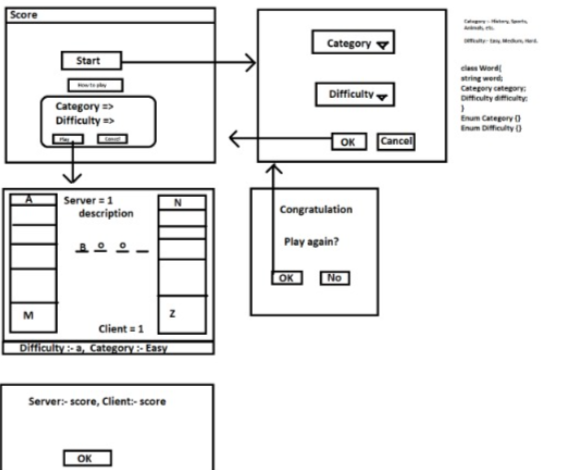
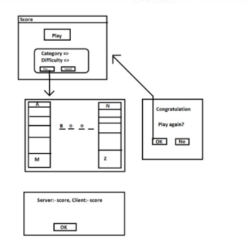
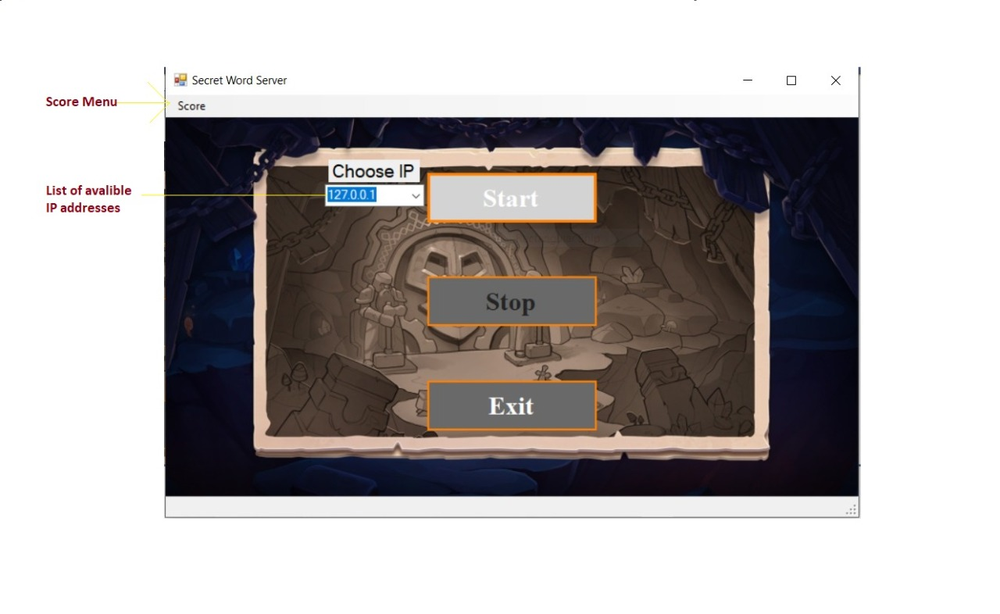
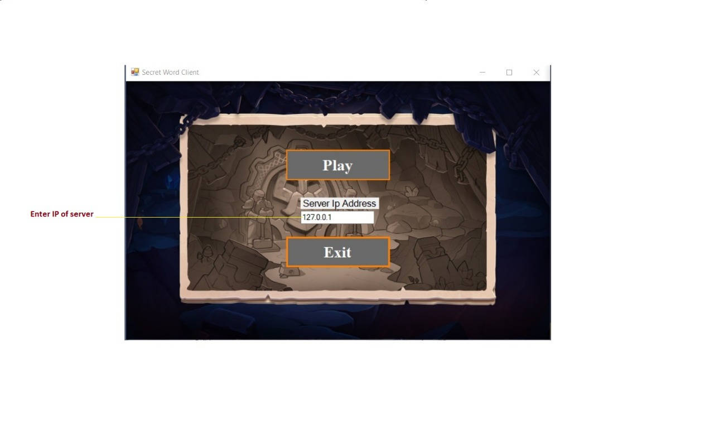
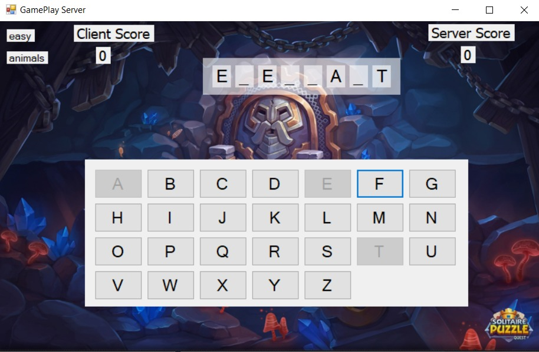

# Secret Word Game Documentation

## Introduction
Secret Word is a guessing game for two players. One player (*server*), Chooses the category and difficulty of the game and the word is generated randomly from database.
Then start the game with (*server*) turn, try to guess the word letters if he fail in letter the other player (*Client*) continue playing.
The word to guess is represented by a row of dashes, giving the number of letters. If the guessing player suggests a letter which occurs in the word, the program writes it in all its correct positions. If the suggested letter does not occur in the word, the other player continue playing and guess the next letter.
The game is over when:
The guessing player completes the word, or guesses the whole word correctly.

## HOW TO PLAY
When the first player (*server*) press the start button he choose the category and difficulty and wait for second player (*client*) to confirm the choice. The second player has to enter the ip address for the server that he play with and press ok if he accepts the difficulty and category chosen by the server then the game starts.
Our code will generate a word which has to be guessed by the player. So, at the output screen will exist marked out blanks (short lines) for each letter of a word. Then the player will guess a letter. If that letter is in the word(s) then the project will write the letter at everyplace it appears, and cross out that letter in the alphabet. If the letter isn't in the word then we cross out the letter from the list. The player will continue guessing the letters until he guess wrong letter then the other player will continue the guessing.
After each game the score will be increased by 1 for the winner.
At the end the two players will be asked to play again if both of the players accepted the game will be started again 
If one of them refused to play again the game will be closed
And if any of them closed the game the game will be finished

## Installation tools
-	SQL Server 2014
-	Visual Studio 2019

## How to Run
-	Run dbCreate.sql to create the data base with word list
-	Build the solution 
-	Run server (**secretWordGame.exe**) and start
-	Run client (**SecretWordGameClient.exe**) and play

## Planning
### Server

### Client

## Game logic
### Server:
1. Start server  
2. Load data (categories, Difficulties)  
3. Play () server and client agree  
4. Load word (based on category, difficulty)  
5. Draw #n dashes  
6. Listen () clicked button  
7. check If true expose char(s), notify exposed chars  
8. Check if finish ()  
9. Win, notify client   
10. else go to 6  
11. if wrong => notify client  
12. freeze  
13. client play  
14. if (exposed chars == 0) lose  
15. else defreeze  
16. go to 6  
17. win or lose message, play again?  
18. if yes update score  
19. go to 3  
20. else save score to file  
21. go to 1  

### Client:
1. Connect to server
2. Play () server and client agree
3. Show Available game
4. if ok
5. get word from server
6. Draw #n lines
7. Server Play
8. freeze
9. Listen () for notifications and exposed chars
10. if (exposed chars == 0) lose
11. else 
12. Listen () clicked button
13. check
14. if true expose char(s), notify exposed chars
15. Check if finish ()
16. Win, notify server
17. else go to 12
18. if wrong => notify server
19. go to 8
20. win or lose message
21. play again?
22. if yes update score
23. go to 5
24. go to 1

## ScreenShots

